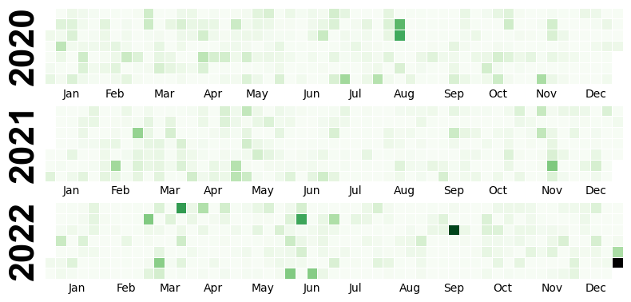
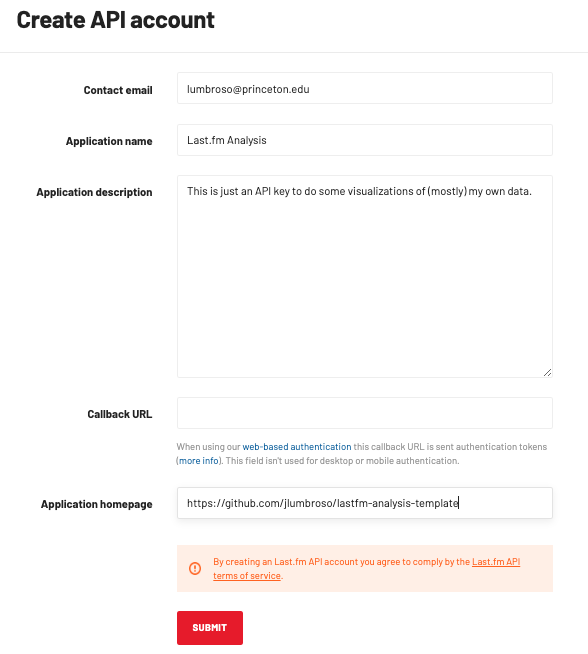

# Last.fm Listening History Visualizations

This repository is a template to do an analysis of Last.fm listening history.

Currently it contains two examples, a word cloud visualization using `wordcloud` and a calendar map visualization using `calmap`.




## 🚠 Overview

The recommended steps to use this template are:

- Follow the **🧰 Initial Setup** instructions below to create your own repository and configure everything needed to launch a GitHub Codespace.
- Take a look at the `notebook.ipynb` file to see how the script works, and make sure to run the entire notebook first.
- Edit the `notebook.ipynb` file to adapt the script to your needs.

If you are unfamiliar with GitHub and/or are new to programming, you may find it useful to know that:

- You can [add files to your repository directly from GitHub](https://docs.github.com/en/repositories/working-with-files/managing-files/adding-a-file-to-a-repository)
- You can [modify the notebook directly from GitHub Codespace by committing your changes to the repository](https://docs.github.com/en/codespaces/developing-in-codespaces/using-source-control-in-your-codespace#committing-your-changes).

## 🧰 Initial Setup

🪪 Before proceeding, [**register** a GitHub account](https://github.com/join) if you don't already have one.

### 1. ✨ Create your own repository

You first need to create your own copy of this "Last.fm Analysis" repository, so that you can configure the API keys, but also so you adapt the script to your needs.

You can **instantiate** this template repository [by clicking the green "Use this template" button above](https://docs.github.com/en/repositories/creating-and-managing-repositories/creating-a-repository-from-a-template#creating-a-repository-from-a-template).

### 2. 🔐 Obtain Last.fm API access

You will need to [create a Last.fm account](https://www.last.fm/join) if you don't already have one.

Then, you will need to [create a Last.fm API account](https://www.last.fm/api/account/create) to get an API key and secret.



Once you click "Submit", you should get a confirmation screen that provides you with the API key ("_API key_") and the API secret ("_Shared secret_").

### 3. 📧 Configure the GitHub secrets

You can now [create encrypted GitHub Codespaces secrets](https://docs.github.com/en/codespaces/managing-your-codespaces/managing-encrypted-secrets-for-your-codespaces) as follows:

- `LASTFM_API_KEY` for the API key;
- `LASTFM_API_SECRET` for the API secret;
- `LASTFM_USERNAME` for your Last.fm username (this is not used to login to the API, but to know which username to run the report on).

### 4. 🚀 Launch the Codespace and code!

Now you can [launch a GitHub Codespace](https://docs.github.com/en/codespaces/developing-in-codespaces/creating-a-codespace-for-a-repository#creating-a-codespace-for-a-repository) for your repository and start coding — almost everything is automated.

## 🏠 Running the Notebook Locally

This part is optional, everything can be done from GitHub Codespaces. If you would like to run this notebook on your own computer, you will first need to install Python and the `git` command-line tool.

Then you need to install `pipenv` if you don't already have it:

```bash
pip install pipenv
```

Assuming `git` is installed, make a copy of your repository by running:

```bash
git clone https://github.com/<your username>/<your repository>
```

Once the repository is cloned, enter the folder and install the dependencies:

```bash
cd <your repository>
pipenv sync --dev
```

Next, create a Jupyter kernel for this project, so that the notebook is able to access the newly installed dependencies:

```bash
pipenv run python -m ipykernel install --name='lastfm-analysis-template' --display-name='lastfm-analysis-template'
```

Create a `.env` file at the root of this project and add the following lines, which will allow the notebook to have access to these credentials:

```bash
LASTFM_API_KEY=<your Last.fm API key>
LASTFM_API_SECRET=<your Last.fm API secret>
LASTFM_USERNAME=<your Last.fm username>
```

They are stored in a special file called `.env` so that they are not committed to the repository because we don't want to share our credentials with the world!

Finally, launch the Jupyter notebook:

```bash
jupyter-notebook notebook.ipynb
```
